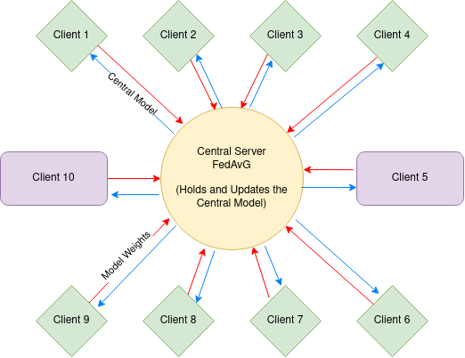

# Project Introduction

This project focuses on the implementation of logistic regression models on 10 different clients, utilizing the concept of federated learning. The Flower framework is employed to simulate federated learning on a local machine, providing a convenient environment for experimentation and evaluation.

# Architecture 

- Every client trains the model locally on their local machine with their part of the dataset. 
- The server aggregates the model weights with taking the weighted average of the client's data portion and test score, then sends the updated model back to the clients.
- The clients then update their local model with the new model weights and repeat the process until the model converges.
# Dataset Characteristics

The dataset used in this project consists of 2 classes and 21 features. Each client in the federated learning setup possesses an identical number of features, ensuring consistency across the clients' data.

Moreover, the clients' datasets exhibit varying sizes of imbalanced data points. For a more detailed understanding of the dataset distribution, please refer to the dirichlet_dist.py file in the project directory.

The example uses the "Diabetes Health Indicators Dataset" from Kaggle. 
For more information about the dataset:
https://www.kaggle.com/datasets/alexteboul/diabetes-health-indicators-dataset
# Federated Averaging Strategy

To aggregate the individual client models effectively, the project adopts the Federated Averaging strategy. This approach allows for the collaborative combination of the locally trained models, leading to a robust and accurate global model.

# Getting Started 
1. Clone the repository
2. Install the the environment with the following command: 
`poetry install `
3. Run the example with the following command: 
`poetry ./run.sh`

# Contributing

Contributions to this project are always welcome. If you find any issues or have ideas for enhancements, please submit a pull request or open an issue on the GitHub repository.
# License

This project is licensed under the MIT License. Feel free to use and modify the code for your own purposes.